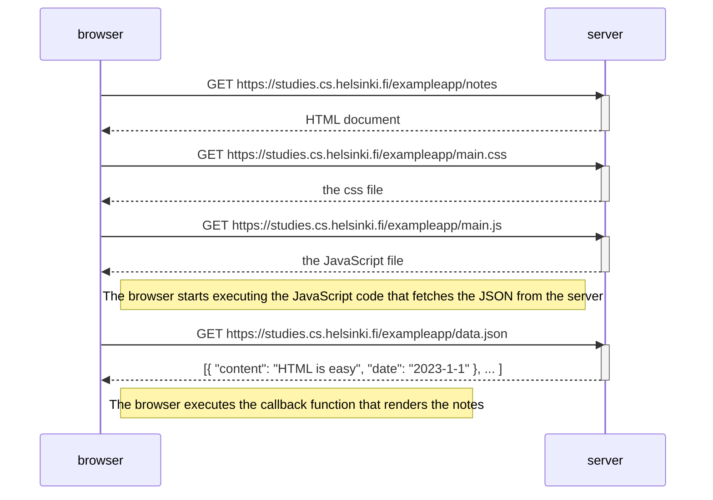

# full_stack_open
Repository for Full Stack open



# testing
```mermaid
sequenceDiagram
    actor User
    participant browser
    participant server

    User->>browser: creating a new note
    activate browser
    browser->>server: POST https://studies.cs.helsinki.fi/exampleapp/new_note

    Note rigth of browser: The from data is sent with HTTP POST to the server

    browser->>server: new GET request https://studies.cs.helsinki.fi/exampleapp/notes
    server-->>browser: Reloads the Notes page
    
```
