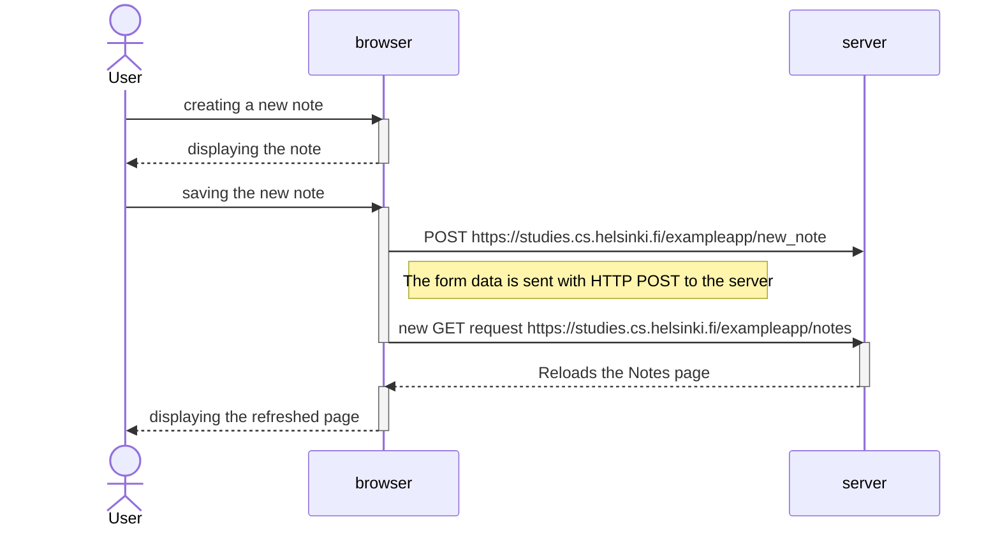
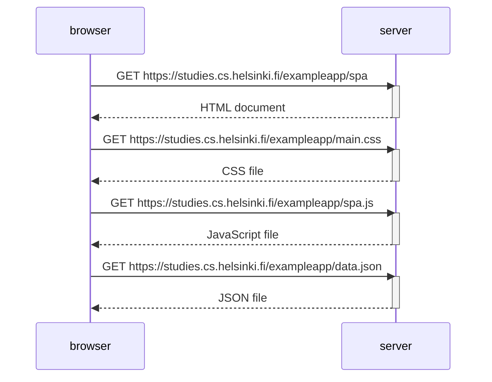
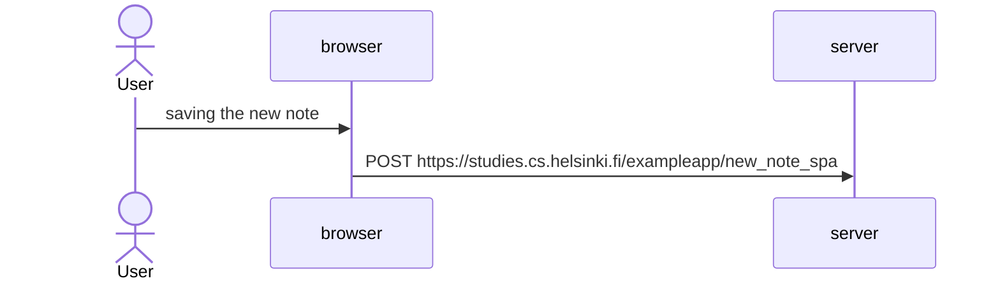

# Part 0 Exercise

# 0.4: User creating a new note diagram

```mermaid
sequenceDiagram
    actor User
    participant browser
    participant server

    User->>browser: creating a new note
    activate browser
    browser-->>User: displaying the note
    deactivate browser

    User->>browser: saving the new note
    activate browser
    browser->>server: POST https://studies.cs.helsinki.fi/exampleapp/new_note

    Note right of browser: The form data is sent with HTTP POST to the server

    browser->>server: new GET request https://studies.cs.helsinki.fi/exampleapp/notes
    deactivate browser
    activate server
    server-->>browser: Reloads the Notes page
    deactivate server

    activate browser
    browser-->>User: displaying the refreshed page
    deactivate browser
```

# 0.5: Single page app diagram

```mermaid
sequenceDiagram
    participant browser
    participant server

    browser->>server: GET https://studies.cs.helsinki.fi/exampleapp/spa
    activate server
    server-->>browser: HTML document
    deactivate server

    browser->>server: GET https://studies.cs.helsinki.fi/exampleapp/main.css
    activate server
    server-->>browser: CSS file
    deactivate server

    browser->>server: GET https://studies.cs.helsinki.fi/exampleapp/spa.js
    activate server
    server-->>browser: JavaScript file
    deactivate server

    browser->> server: GET https://studies.cs.helsinki.fi/exampleapp/data.json
    activate server
    server-->>browser: JSON file
    deactivate server
```

# 0.6: New note in Single page app diagram

```mermaid
sequenceDiagram
    actor User
    participant browser
    participant server

    User->>browser: saving the new note
    %%activate browser%%
    browser->>server: POST https://studies.cs.helsinki.fi/exampleapp/new_note_spa
```
